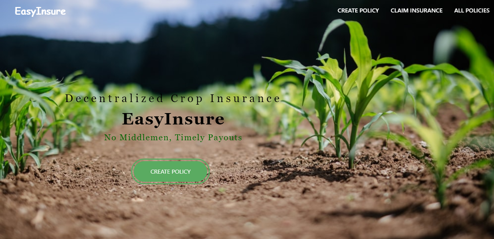
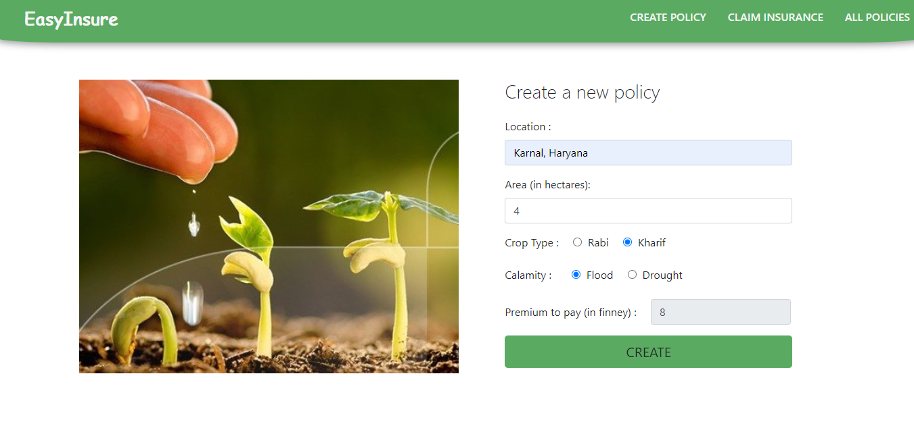
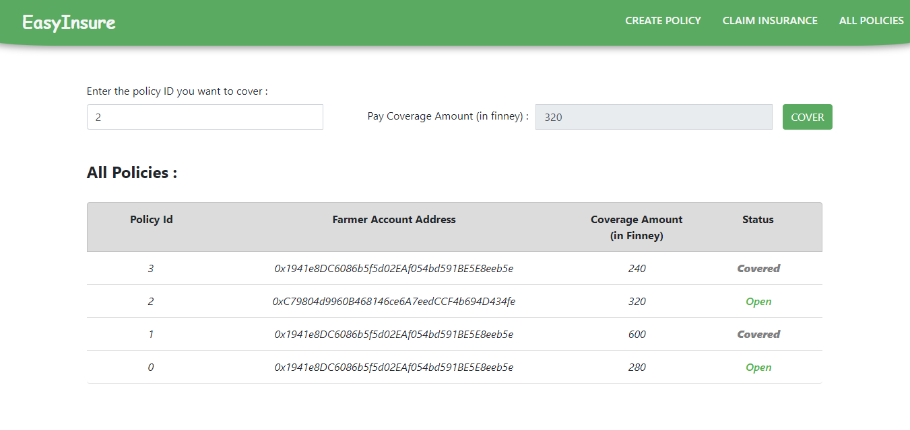
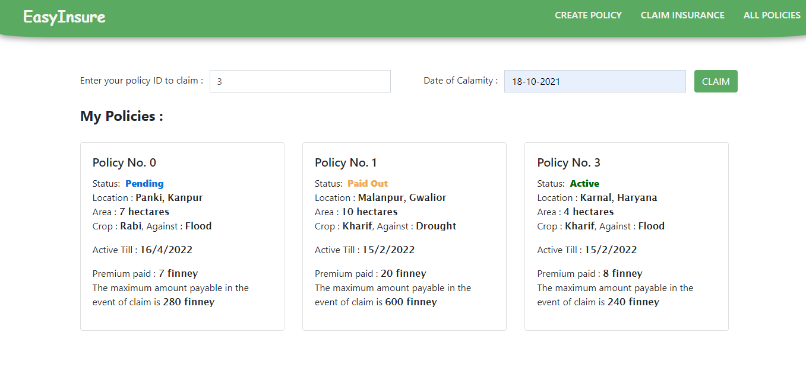
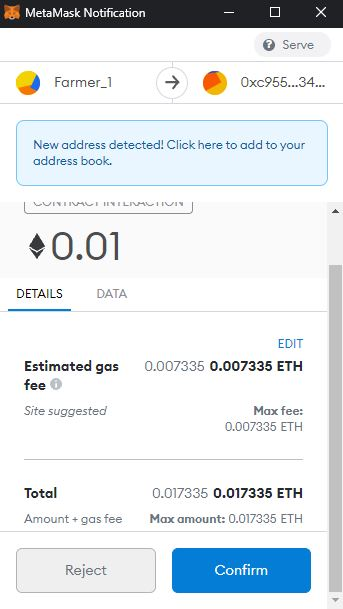

# EasyInsure - Decentralized Crop Insurance System
A decentralized web application that provides crop insurance to farmers against natural calamities like floods, drought etc. In case of any 
disaster, farmers can claim the insurance amount and hence would be provided timely financial assistance according to mentioned policy terms.

## Background
Agriculture in India is livelihood for about 58% of the population and is a key driver of the economy contributing around 20% to the GDP. 
However, the agriculture sector is highly exposed to climate risks and, adverse climatic conditions directly impact agricultural production 
and result in poor crop yields. Since the household income of the farmers are tied to their crop income, they are prone to financial and 
mental stress due to extreme weather conditions.

Crop insurance is a critical risk mitigation tool for those involved in farming sector. Realising the need of crop insurance, successive 
Governments have been implementing various schemes but with limited success. In a simple insurance scheme, farmers pay an insurance premium 
before the upcoming cropping cycle and receive an insurance payout in case they experience a loss on their crops due to climate conditions. 

## Gaps in Current System
- Poor claim settlement experience due to delay in premium payments by the authority and routing of the process through banks who make 
errors wrt. insurance guidelines leading to wrong deductions
- No policy document available with farmers leading to lack of transparency
- Significant loopholes in the assessment of crop loss
- Non-availability of funds due to less participation from private sectors
- Absence of a dedicated coordinated agency across the entire insurance process

## Objectives
Our system has the following objectives that addresses the above shortcomings:
- To build an easy to use, secure web-application that manages insurance policies, farm details and related information.
- To use Blockchain technology to design a solution that provides a safe, secure and transparent system where the information related to 
the involved stakeholders isn’t hampered.
- To remove intermediary parties such as banks or notaries by automating the transaction process. This would inhibit any kind of delay caused due 
to intervention of third parties.
- To automate the crop and weather assessment process by connecting with Chainlink (Decentralized Oracle Network) that provides weather conditions
for the particular coordinated at a given time through different off-chain APIs.

## Methodology
The decentralized nature of the model is categorized into two parts -
- **Policy Creation** : 
  Farmer can enter details about their crop type, farm location, area, and calamity type for which they need cover. Based on these details, the system 
  generates a premium amount that needs to be paid beforehand by the farmer and a coverage amount that the farmer would receive in case of a valid claim. 
  Once the premium is paid, the policy gets created and its status becomes *Pending*. The policy gets covered as soon as the coverage amount gets raised by 
  some investor. This changes the status of policy to *Active* and it gets activated for claim. 
- **Policy Claim** :
  Farmers can claim policy in case their farmland experience crop loss due to floods, droughts etc. After the farmers claim their policy (before it is *Timed Out*), 
  the smart contracts consult with the Chainlink that provides the weather conditions coming through off chain weather APIs based on the farm coordinates and 
  calamity date.
  
  The amount to be paid to the farmer is then calculated based on the weather severity. A simple calculation of the coverage amount due to floods is explained below -
  1. Rainfall < 10mm : 100% coverage amount paid to the investor
  2. 10mm < Rainfall <= 15mm : 50% coverage amount to the farmer and 50% to investor
  3. Rainfall > 15mm : 100% coverage amount paid to the farmer
  
  The claim processing and payment part is executed without any delay as it is automated by the smart contracts. After the policy is claimed, the status changes to *Paid Out*.

## Screens

 
*
 Fig. 1: Landing Page 
*

 
*
 Fig. 2: Create Policy (for Farmers) 
*

 
*
 Fig. 3: View all Policies / Cover Policy (for Investors) 
*

 
*
 Fig. 4: View own Policies / Claim Policy (for Farmers) 
*

*
 
   
Fig. 5: Typical Metamask Window during transaction 
*

## Tech Stack
- Ethereum Smart Contracts (Solidity)
- Truffle Suite
- React.js
- MetaMask (Digital Wallet Provider)
- Ganache-CLI
- Chainlink (Decentralized Oracle Network)

## Built by
- [Swatik Paul](https://github.com/swatikpl44)

